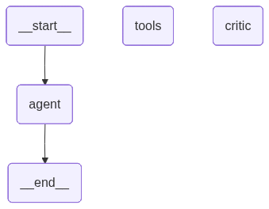

AI Customer Support Agent with RAG, LangGraph and FastAPI
Overview

AI Customer Support Agent is an end-to-end Agentic AI system designed to answer customer queries using Retrieval-Augmented Generation (RAG), ReAct reasoning, tool calling, conversation memory, LangGraph workflows, and a production-ready FastAPI backend.

The project leverages locally running open-source Large Language Models through Ollama and combines retrieval, reasoning, tool usage, memory management, and API serving to provide accurate and context-aware customer support responses.

Use Cases

The system can answer questions related to:

Product information
Shipping details
Return policies
Refund procedures
Order tracking
Frequently Asked Questions
Escalation to human agents

Example queries:

Where is my order 1001?

How long does shipping take?

Can I return a product after 30 days?

Tell me about your refund policy.
Features
Retrieval-Augmented Generation (RAG)

Implemented features

Document ingestion pipeline
Text chunking
Embedding generation
ChromaDB vector storage
Semantic similarity search
Knowledge base retrieval
Tool Calling

Implemented tools

search_knowledge_base

Performs semantic search over ChromaDB and retrieves relevant documents.

check_order_status

Returns order tracking information.

escalate_to_human

Escalates customer requests requiring human intervention.

ReAct Agent

Implemented features

Manual ReAct loop
Tool selection
Observation generation
Multi-step reasoning
Final answer synthesis
Conversation Memory

Supports

Session-based memory
Window buffer memory
Multi-turn conversations
Conversation history retention

Memory implementation

deque(maxlen=10)
LangGraph Workflow

Implemented nodes

Agent Node
Tool Node
Critic Node

Capabilities

Stateful execution
Conditional routing
Tool invocation
Response critique
Hallucination reduction
Workflow
FastAPI Backend

Implemented endpoints

GET /health

POST /api/v1/chat

WebSocket /api/v1/ws/{session_id}

Implemented features

Pydantic request validation
Pydantic response validation
OpenAPI documentation
Swagger UI integration
Token streaming using WebSockets
Health checks
Global exception handling
CORS middleware
Models Used
Development Model
Llama 3.1 8B

Used for

Tool calling
ReAct agent
LangGraph workflow
FastAPI backend

Reason

Stable support for LangChain tool calling and agent workflows.

Preferred Production Model
Qwen 2.5 7B

Reason

Generated more professional and detailed customer-support responses during evaluation.

Embedding Model
nomic-embed-text

Used for

Embedding generation
Vector similarity search
ChromaDB integration
Backup Model
Phi-3

Reason

Fastest inference speed on available hardware.

Technology Stack
Programming Language
Python
Frameworks
LangChain
LangGraph
FastAPI
Vector Database
ChromaDB
Local Model Serving
Ollama
API Development
FastAPI
Pydantic
HTTPX
WebSockets
Memory
Conversation Buffer Memory
Session Memory
deque(maxlen=10)
Development Tools
VS Code
Git
GitHub
Project Architecture
ReAct Workflow
FastAPI Architecture
Project Structure
backend/

├── agents/
│   ├── prompts.py
│   ├── tools.py
│   ├── memory.py
│   ├── react_agent.py
│   ├── graph_agent.py
│   ├── critic_graph.py
│
├── rag/
│   ├── ingest.py
│   ├── retriever.py
│
├── api/
│   ├── main.py
│   ├── models.py
│   ├── dependencies.py
│   │
│   └── routers/
│       ├── chat.py
│       └── health.py
│
frontend/

docs/

docker/

data/

test_ws.py

README.md

Running the Application
Start Ollama
ollama serve
Run FastAPI
uvicorn backend.api.main:app --reload
Swagger UI
http://localhost:8000/docs
WebSocket Client
python test_ws.py
Current Status
Implemented
Local LLM execution
ChromaDB integration
RAG pipeline
Tool calling
ReAct agent
Session memory
LangGraph workflow
Critic node
FastAPI backend
WebSocket streaming
Health monitoring
Global exception handling
Upcoming
Redis session persistence
React frontend
Docker deployment
Evaluation and benchmarking
Screenshots
Swagger Documentation

LangGraph Workflow
